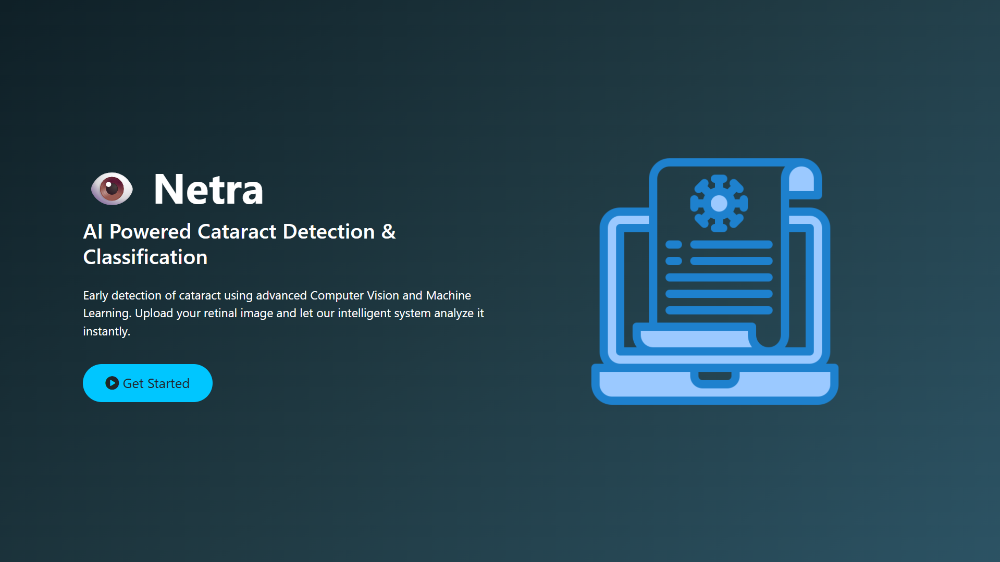
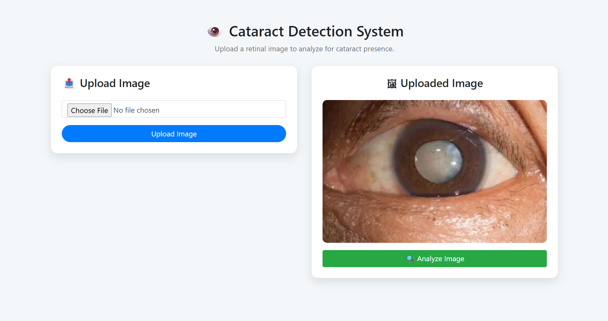
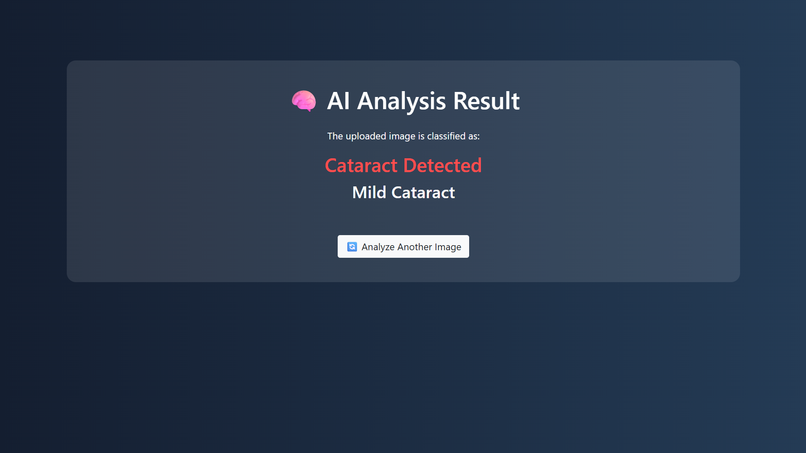

# 👁️ Netra - AI Powered Cataract Detection & Classification

<div align="center">


### AI Powered Cataract Detection & Severity Classification System

Detect cataract from retinal images using a hybrid Machine Learning and Deep Learning pipeline.

🌐 **Live Demo:** https://cataract-detection-and-classification.onrender.com/

</div>

---

# 📖 Overview

Netra is an AI-powered web application designed to automatically detect cataracts from retinal/eye images and classify the severity level of the disease.

The project combines:

- Traditional Machine Learning
- Computer Vision
- Texture Analysis
- Deep Learning

to create a complete end-to-end cataract detection system.

The application allows users to upload an eye image and instantly receive:

✅ Cataract Detection

✅ Cataract Severity Classification

✅ AI-based Analysis Result

---

# 🎯 Problem Statement

Cataract is one of the leading causes of blindness worldwide.

Manual diagnosis requires:

- Medical expertise
- Clinical equipment
- Time-consuming examination

This project aims to provide an automated AI-based screening system capable of detecting cataracts quickly from eye images.

---

# 🚀 Live Demo

### Web Application

https://cataract-detection-and-classification.onrender.com/

---

# 🖼️ Application Screenshots

## Home Page



---

## Upload & Analysis Page



---

## Prediction Result Page



---

# 🏗️ System Architecture

The system works in two phases:

## Phase 1: Cataract Detection

```text
Input Image
      │
      ▼
Image Preprocessing
      │
      ▼
Feature Extraction
      │
      ▼

 ┌─────────────┐
 │    SIFT     │
 └─────────────┘

        +

 ┌─────────────┐
 │    GLCM     │
 └─────────────┘

      │
      ▼
Feature Concatenation
      │
      ▼
Logistic Regression
      │
      ▼
Cataract / No Cataract
```

---

## Phase 2: Severity Classification

```text
Cataract Detected
        │
        ▼
 Eye Region Extraction
        │
        ▼
 Image Processing
        │
        ▼
  SqueezeNet CNN
        │
        ▼

 ┌─────────────────┐
 │ Mild Cataract   │
 │ Normal Cataract │
 │ Severe Cataract │
 └─────────────────┘
```

---

# ⚙️ Technologies Used

## Programming Language

- Python

## Web Development

- Flask
- HTML
- CSS
- Jinja2 Templates

## Machine Learning

- Scikit-Learn
- Logistic Regression

## Deep Learning

- TensorFlow
- Keras
- SqueezeNet CNN

## Computer Vision

- OpenCV
- SIFT Feature Extraction

## Image Processing

- NumPy
- Scikit-Image
- GLCM

## Deployment

- Render

---

# 🧠 Machine Learning Pipeline

## Step 1: Image Upload

The user uploads a retinal image through the web interface.

---

## Step 2: Image Preprocessing

The image is:

- Loaded using OpenCV
- Converted into grayscale
- Resized to fixed dimensions

---

## Step 3: Feature Extraction

### SIFT Features

Scale-Invariant Feature Transform (SIFT) extracts important keypoints and descriptors from the retinal image.

Advantages:

- Scale Invariant
- Rotation Invariant
- Robust Feature Matching

---

### GLCM Features

Gray Level Co-occurrence Matrix (GLCM) captures texture information from retinal images.

Extracted Features:

- Contrast
- Dissimilarity
- Homogeneity
- Energy
- Correlation

---

## Step 4: Binary Classification

Features extracted from:

- SIFT
- GLCM

are combined and passed to a Logistic Regression classifier.

Output:

- Cataract Detected
- No Cataract

---

## Step 5: Severity Classification

If cataract is detected:

- Eye region is isolated
- Processed image is passed to SqueezeNet CNN

Output Classes:

- Mild Cataract
- Normal Cataract
- Severe Cataract

---

# 📊 Model Outputs

## Binary Detection

| Prediction | Meaning |
|------------|----------|
| Cataract Detected | Cataract Present |
| No Cataract | Healthy Eye |

---

## Severity Classification

| Class | Description |
|---------|------------|
| Mild Cataract | Early-stage cataract |
| Normal Cataract | Moderate cataract condition |
| Severe Cataract | Advanced cataract stage |

---

# 📂 Project Structure

```text
Cataract-Detection-and-Classification
│
├── GUI
│   ├── app.py
│   ├── log_model.sav
│   ├── mainmodel.pkl
│   ├── squeezenet.h5
│   │
│   ├── static
│   │   └── inputimages
│   │
│   └── templates
│       ├── home.html
│       ├── main.html
│       ├── about.html
│       └── result.html
│
├── NMIS
│
├── phase 1 Binary
│
├── phase 2 Types
│
├── screenshots
│   ├── home-page.png
│   ├── upload-page.png
│   └── result-page.png
│
├── requirements.txt
│
└── README.md
```

---

# 🔄 Workflow

1. User uploads eye image.
2. Image preprocessing begins.
3. SIFT features are extracted.
4. GLCM texture features are extracted.
5. Features are combined.
6. Logistic Regression detects cataract.
7. If cataract exists:
   - Eye region is segmented.
   - SqueezeNet CNN classifies severity.
8. Result is displayed on the web application.

---

# 🛠️ Installation

## Clone Repository

```bash
git clone https://github.com/AshishVerma10/Cataract-Detection-and-Classification.git

cd Cataract-Detection-and-Classification
```

---

## Create Virtual Environment

### Windows

```bash
python -m venv .venv

.venv\Scripts\activate
```

### Linux/Mac

```bash
python3 -m venv .venv

source .venv/bin/activate
```

---

## Install Dependencies

```bash
pip install -r requirements.txt
```

---

# ▶️ Run Locally

Move to GUI directory:

```bash
cd GUI
```

Run:

```bash
python app.py
```

Open Browser:

```text
http://127.0.0.1:5000
```

---

# 📦 Requirements

Main libraries used:

```text
Flask
TensorFlow
OpenCV
Scikit-Learn
Scikit-Image
NumPy
H5Py
Werkzeug
```

---

# 🌍 Deployment

The application is deployed using Render Cloud Platform.

### Live Application

https://cataract-detection-and-classification.onrender.com/

---

# 🎓 Academic Concepts Demonstrated

This project covers:

- Machine Learning
- Deep Learning
- Computer Vision
- Medical Image Processing
- Feature Engineering
- Image Classification
- CNN Architectures
- Flask Web Development
- Model Deployment

---

# 🔮 Future Improvements

Potential future enhancements:

- Multi-Disease Eye Detection
- Cataract Localization
- Explainable AI (XAI)
- Mobile App Version
- REST API Integration
- Real-Time Camera Detection
- Improved CNN Architecture
- Larger Medical Dataset

---

# 👨‍💻 Author

### 👨‍💻 Ashish Kumar Verma

B.Tech – Computer Science & Engineering

Madan Mohan Malaviya University of Technology, Gorakhpur

### 💼 LinkedIn

https://www.linkedin.com/in/ashishverma2210

### 🐙 GitHub

https://github.com/AshishVerma10

### 🌐 Live Application

https://cataract-detection-and-classification.onrender.com/

### 📧 Email

vashishverma10@gmail.com

### Skills

- Python
- C++
- Machine Learning
- Deep Learning
- Computer Vision
- Flask
- Data Structures & Algorithms

### GitHub

https://github.com/AshishVerma10

---

# ⭐ Support

If you found this project useful, consider giving it a ⭐ Star on GitHub.

It helps others discover the project and motivates further development.

---

## ⚠️ Disclaimer

This project is developed for educational and research purposes only.

It is not intended to replace professional medical diagnosis or treatment.